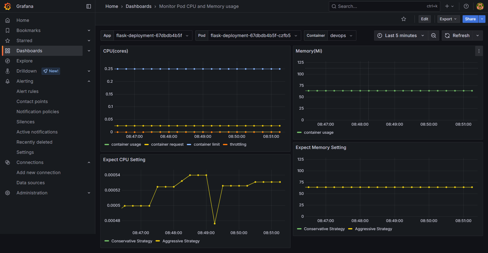
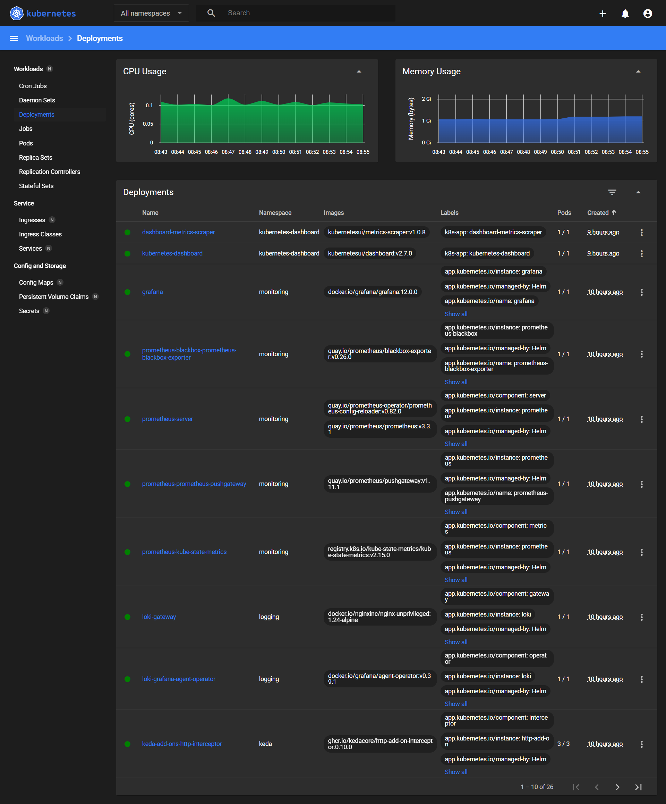

# Architecture Diagram

## Auto Scaling Diagram

## Centralize Monitoring & Logging Diagram

# Component
- Google Kubernetes Engine
- Flask App
- Nginx Ingress
- Kubernetes Event Driven Autoscalling
- Loki & Promtail
- Prometheus
- Grafana
- Kubernetes Dashboard
- Terraform (For provisioning GKE)

# Deployment Flow
The manifests in this deployment use both traditional YAML and Helm, and each subdirectory contains a README.md file with deployment instructions. The deployment should be carried out in the following order
- flask/README.md => build and push container
- terraform/README.md => provisioning infrastructure (VPC & GKE)
- ingress/README.md => deploy ingress
- keda/README.md => deploy keda
- flask-deployment/README.md => deploy the flask application
- logging/README.md => deploy logging, loki and promtail
- monitoring/README.md => deploy monitoring stack such as prometheus grafana, kubernetes dashboard, and also setup alerting system into discord

# KEDA Scaling Logic
- Source metric: HTTP request
- Target: Deployment flask-deployment
- Policy:
  - min replicas: 2
  - max replicas: 5
  - http request: max 30 request per sec per pod

# Security & Networking
- Exposed Port:
  - 80 & 443 (http is force redirect to https)
- SSL/TLS
  - All certificate on this deployment is valid for wildcard *.angga-sr.xyz
  - Sub-domain that used on this deployment
    - app2.angga-sr.xyz
    - prometheus.angga-sr.xyz
    - grafana.angga-sr.xyz
    - dashboard.angga-sr.xyz
- Whitelist source range
  - prometheus.angga-sr.xyz
    - 23.94.73.116/32, 10.68.0.0/16
  - grafana.angga-sr.xyz
    - 23.94.73.116/32, 10.68.0.0/16
  - dashboard.angga-sr.xyz
    - 23.94.73.116/32, 10.68.0.0/16
  - app2.angga-sr.xyz => direct public feching

# Screenshot
- ## Application
  
  
  
- ## Alerting Discord
  
- ## GKE on GCP
  
- ## Grafana
  
  
  
  
  
- ## Kubernetes Dashboard
  
- ## Prometheus
  
  
